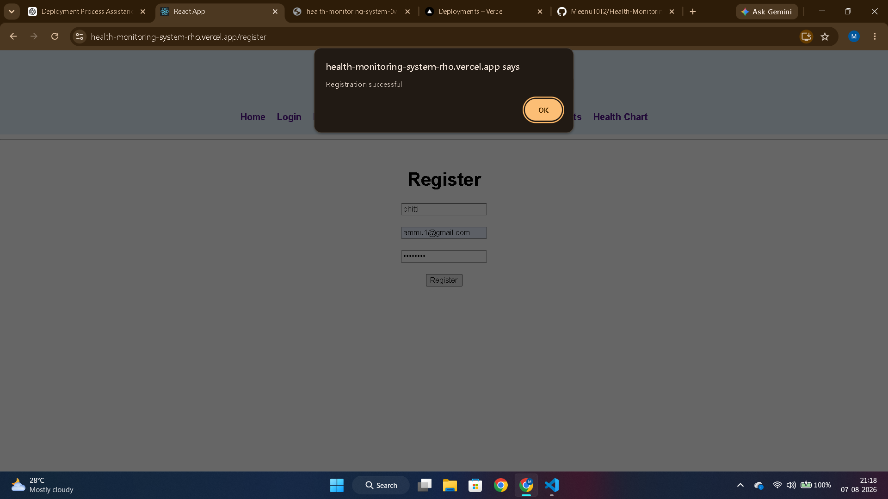
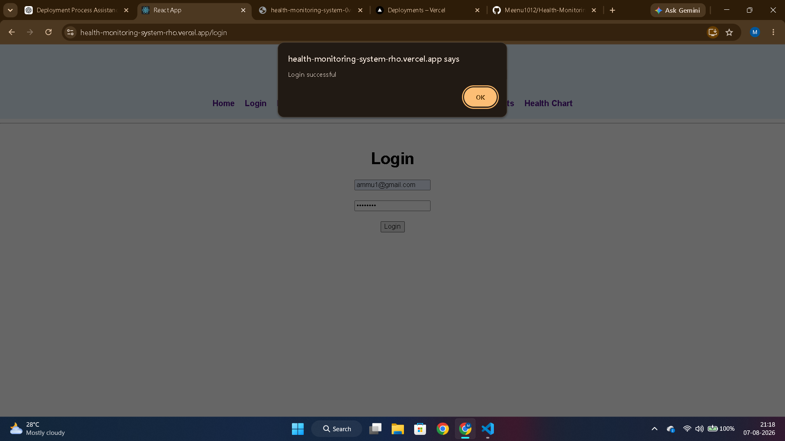

# 🏥 Health Monitoring System

A full-stack **Health Monitoring System** built using the **MERN Stack (MongoDB, Express.js, React.js, Node.js)**. This application allows users to register, log in, manage patient information, and store health records through a simple web interface.

---

## 🌐 Live Demo

**Frontend (Vercel):**  
https://health-monitoring-system-rho.vercel.app

**Backend (Render):**  
https://health-monitoring-system-0vmd.onrender.com

---

## 🚀 Features

- ✅ User Registration
- ✅ User Login
- ✅ Add Patient Details
- ✅ Health Data Entry
- ✅ Store Health Records in MongoDB
- ✅ Responsive Web Interface

---

## 🛠 Technologies Used

### Frontend
- React.js
- React Router
- CSS

### Backend
- Node.js
- Express.js

### Database
- MongoDB Atlas

### Deployment
- Vercel (Frontend)
- Render (Backend)

---

## 📂 Project Structure

```
Health-Monitoring-System/
│
├── client/              # React Frontend
├── server/              # Node.js & Express Backend
├── screenshots/         # Project Screenshots
├── README.md
├── package.json
└── server.js
```

---

## 📸 Project Screenshots

### 🏠 Home Page


### 📝 User Registration


### 🔑 User Login


### 👤 Add Patient


### ❤️ Health Data Entry


---

## ⚙️ Installation

1. Clone the repository:

```bash
git clone https://github.com/Meenu1012/Health-Monitoring-System.git
```

2. Install dependencies:

```bash
npm install
```

3. Start the backend:

```bash
npm start
```

4. Start the frontend:

```bash
cd client
npm start
```

---

## 🚀 Future Enhancements

- Edit Patient Information
- Delete Patient Information
- Health Reports
- Health Monitoring Charts
- Dashboard with Health Summary
- Appointment Scheduling
- Email Notifications

---

## 👩‍💻 Author

**Meenakshi**

GitHub:  
https://github.com/Meenu1012

---

⭐ If you found this project useful, consider giving it a star on GitHub!