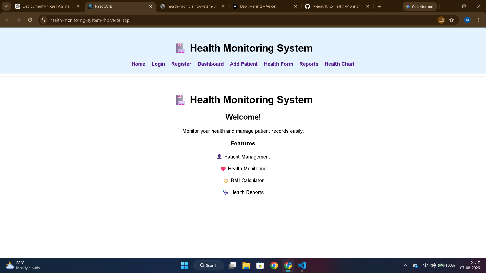
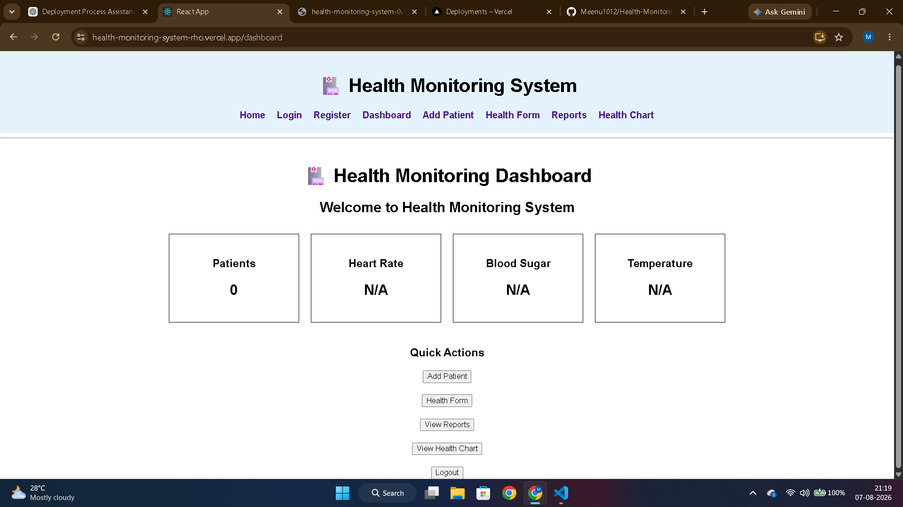
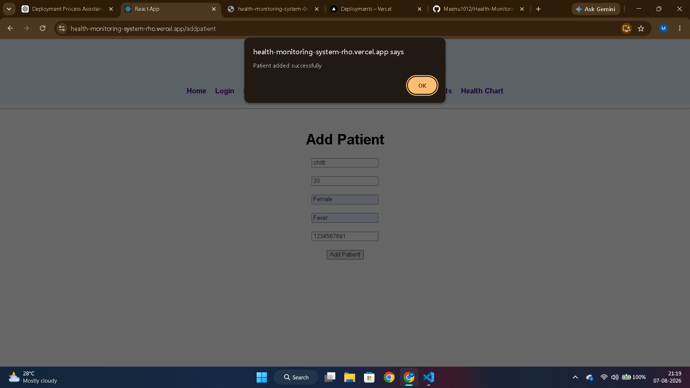
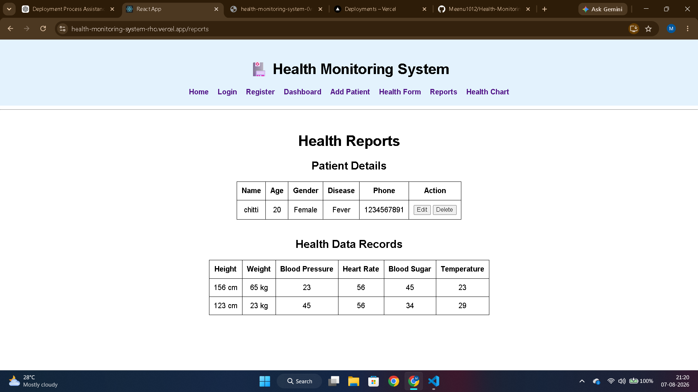
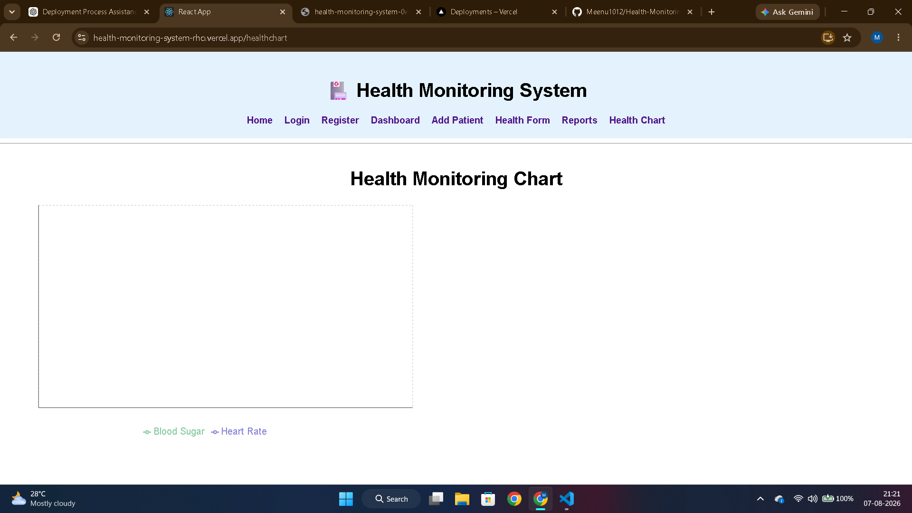

# 🏥 Health Monitoring System

A full-stack **Health Monitoring System** built using the **MERN Stack** (MongoDB, Express.js, React.js, Node.js).

This application allows users to register and log in, manage patient records, enter health information, generate health reports, and visualize health statistics through charts.

---

## 🚀 Features

- 👤 User Registration and Login
- ➕ Add Patient Details
- ✏️ Update Patient Information
- ❌ Delete Patient Information
- ❤️ Health Data Entry
- 📊 Health Reports
- 📈 Health Monitoring Charts
- 📋 Dashboard with Health Summary
- 📱 User-friendly interface

---

## 🛠 Technologies Used

### Frontend

- React.js
- React Router
- Recharts
- HTML
- CSS
- JavaScript

### Backend

- Node.js
- Express.js

### Database

- MongoDB Atlas

---

## 📂 Project Structure

```text
Health-Monitoring-System/
│
├── client/
├── server/
├── screenshots/
│   ├── Home.png
│   ├── register.png
│   ├── login.png
│   ├── dashboard.png
│   ├── patient-details.png
│   ├── health-form.png
│   ├── health-report.png
│   └── health-chart.png
│
├── README.md
├── package.json
└── server.js
```

---

## 📸 Project Screenshots

### 🏠 Home Page



### 📝 User Registration


### 🔐 User Login


### 📊 Dashboard



### 👤 Patient Details



### ❤️ Health Data Entry


### 📄 Health Report



### 📈 Health Chart



---

## ⚙️ Installation

### Clone the Repository

```bash
git clone https://github.com/Meenu1012/Health-Monitoring-System.git
```

### Go to the Project Folder

```bash
cd Health-Monitoring-System
```

### Install Backend Dependencies

```bash
npm install
```

### Install Frontend Dependencies

```bash
cd client
npm install
```

---

## ▶️ Running the Application

### Start Backend

From the project root:

```bash
npm start
```

### Start Frontend

Open another terminal:

```bash
cd client
npm start
```

---

## 🌐 Live Demo

### Frontend

https://health-monitoring-system-h0.vercel.app/

### Backend API

https://health-monitoring-system-0vmd.onrender.com/

---

## 🚀 Future Enhancements

- 📧 Email Notifications
- 👨‍⚕️ Doctor Dashboard
- 📅 Appointment Booking
- ⚖️ BMI Calculator
- 📄 PDF Report Download
- 📱 Improved Mobile Responsive UI
- 🔔 Health Reminders

---

## 👩‍💻 Developer

**Meenakshi**

GitHub: https://github.com/Meenu1012

---

⭐ If you like this project, please give it a star on GitHub!

Thank you for visiting the **Health Monitoring System** repository! 🏥❤️